# HockeyShop

# 

## Description

Welcome to HockeyShop!

This app is a fully funtioncal E-Commerce store built using the MERN stack. Notable features include user authenticaion, user profiles, Admin-level product and user management tools, complete checkout process including shipping info and mock payment (via PayPal API), dynamic cart display, and product ratings plus reviews. Logging in or signing up is required to view the complete checkout process, order history, and all Admin-level functions.

Please view the deployed application [here](https://hockeyshop.herokuapp.com/) or navigate to the [Usage](#usage) section below to view a self-guided tour through the application's functionality.

Technologies used to build this app include: MongoDB, Express, React, Node.js, Redux, React Bootstrap, Mongoose, JavaScript, JWT Authenticaion, PayPal API, HTML, CSS.

## Table of Contents

- [Installation](#installation)
- [Usage](#usage)
  - [Home Screen](#home-screen)
  - [Sign Up](#sign-up)
  - [Sign In](#sign-in)
  - [Product Details](#product-details)
  - [User Profile](#user-profile)
  - [Cart](#cart)
  - [Checkout Process](#checkout-process)
  - [Admin Dashboard](#admin-dashboard)
    - [Users List](#users-list)
    - [Edit User Info](#edit-user-info)
    - [Products List](#products-list)
    - [Edit Product Info](#edit-product-info)
    - [Create New Product](#create-new-product)
    - [Orders List](#orders-list)
    - [Update Order Info](#update-order-info)
- [License](#licenses)
- [Contributing](#contributing)
- [Tests](#tests)
- [Questions](#questions)

## Installation

_How to install & get the application running._

As this application is running on a production build it will be unable to run locally due to protected environment variables. Feel free to git clone the SSH Key and explore the code locally! If you are interested in viewing the live application please visit the [live site](https://hockeyshop.herokuapp.com/) on Heroku.

## Usage

_Guidelines for usage & application demo._

HockeyShop is a fully functional E-Commerce store that was built purely for demo purposes only. As such, it is a robust and complex application. Please view the sections below for a detailed guide through its awesome functionality!

---

### Home Screen

The first screen you'll see!

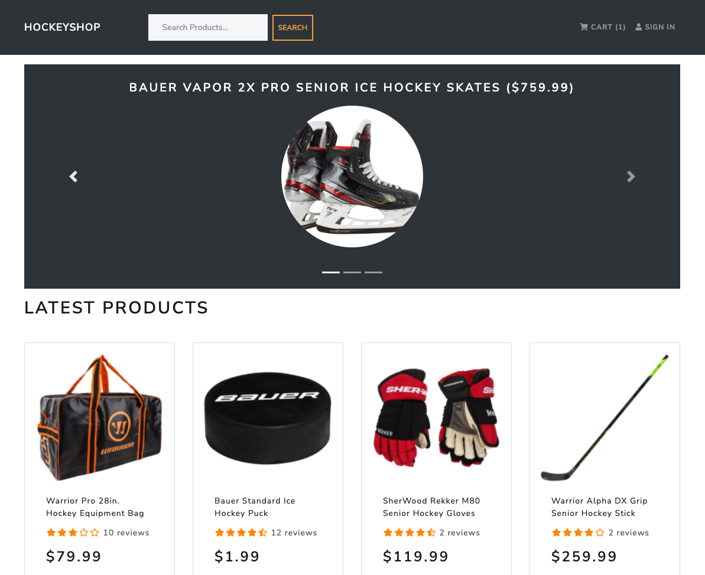

---

### Sign Up

Click `Sign In` on the top right of the page, then select `Register` to create a new account:

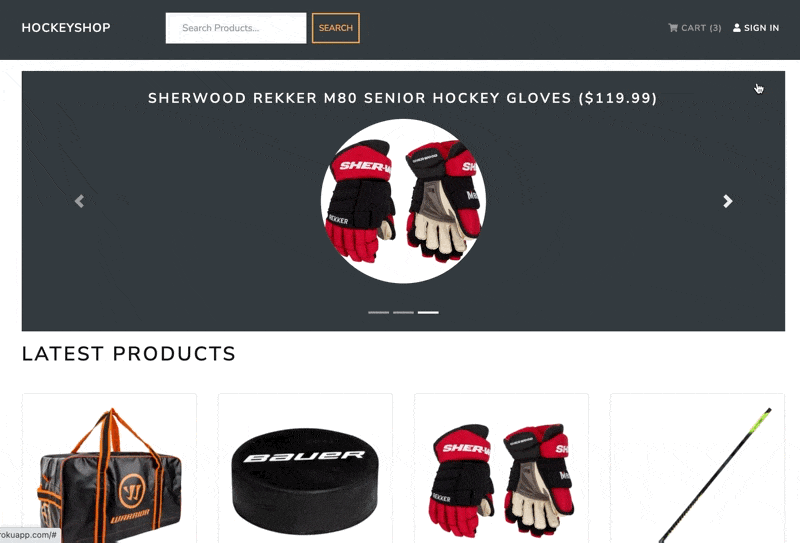

---

### Sign In

If you already have an existing account, simply click `Sign In` on the top right of the page!

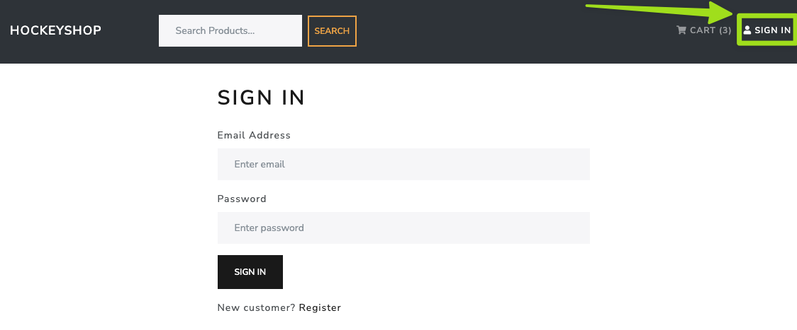

---

### Product Details

Select any product from the home screen to view the product details page. The details shown here include product name, image, description, price, ratings, reviews, In-stock/Out-of-stock status, and quantity selection:

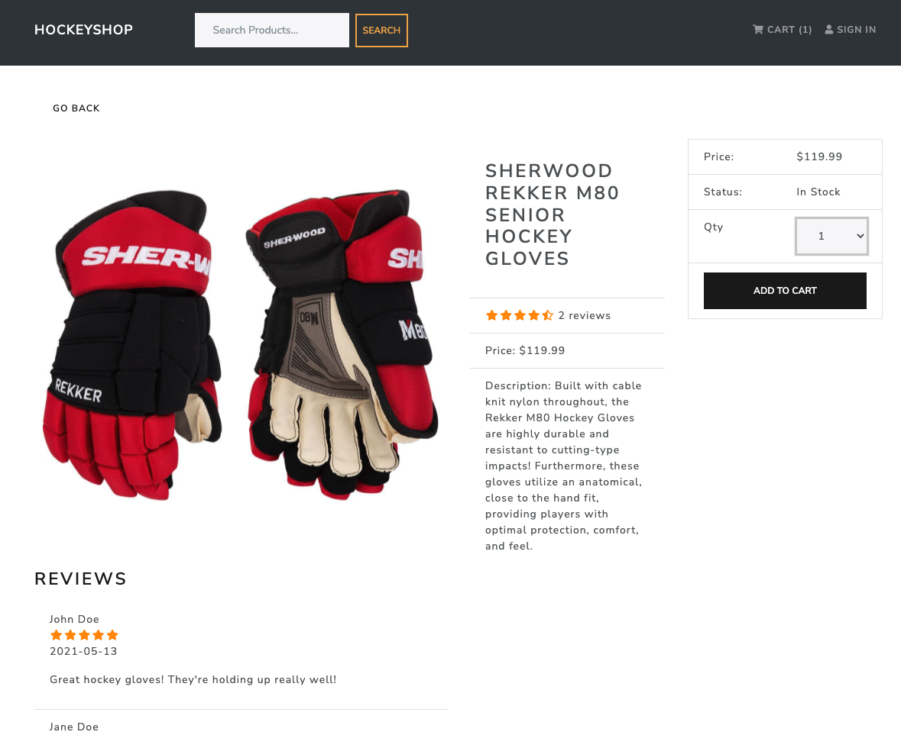

---

### User Profile

When logged in as a normal user, click on your name in the top right and choose `Profile` from the dropdown menu. Within the user profile, you have the ability to update your name, email address, and password. You're also able to view your complete order history from this screen, including all order statuses and links to the original order confirmations:

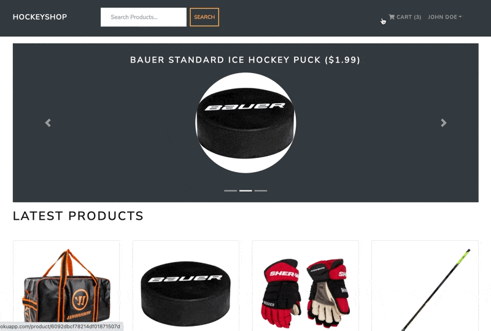

NOTE: Admin users will see additional dropdown options that are used to manage all users and products within the app. Please refer to the [Admin Dashboard](#admin-dashboard) section below for more info!

---

### Cart

Click `Cart` in the top right to view all items that have been added to your cart. From this screen, you may update the quantities of the cart items, delete them from your cart, or proceed to checkout.

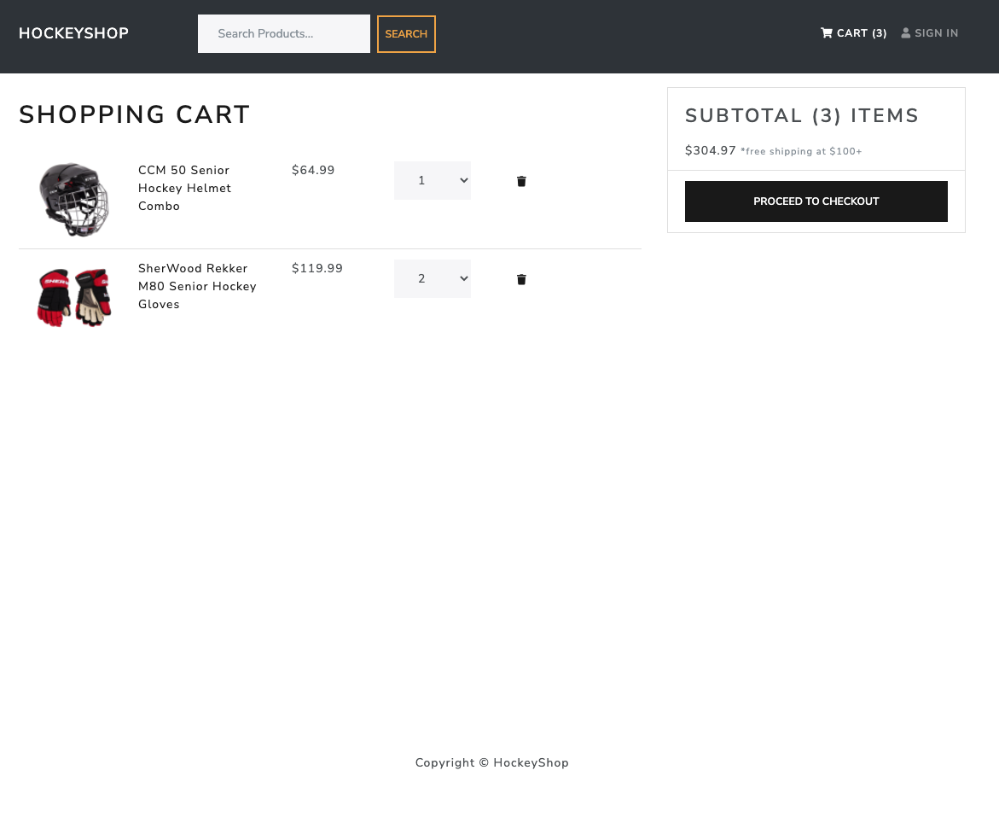

---

### Checkout Process

Once `Proceed to Checkout` is clicked within your [Cart](#cart), the checkout process will begin!

If you aren't signed in, you will first be redirected to the [Sign In](#sign-in) screen. Otherwise, you will be required to input your shipping info, select a payment method (PayPal is the only option currently), and then finalize the order by pressing `Place Order`:

After doing so, you will see the order confirmation screen displaying all of the details from your order. You will then have the ability to pay via PayPal or Credit/Debit card through the PayPal API (please note this is a demo app and it utilizes the PayPal sandbox - no real payments are processed):

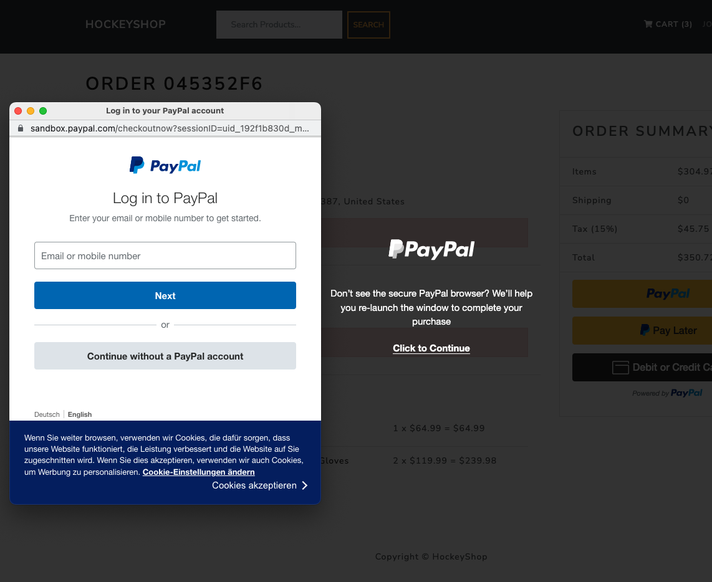

Once payment is successfully submitted, the order confirmation screen will update to display a green `Paid on` message including the timestamp of the payment:

---

### Admin Dashboard

Admin users will have access to an extensive Admin dashboard that gives them complete control to add/edit/delete users, products, and existing orders within the platform. This may be accessed by clicking the `Admin` dropdown and selecting either `Users`, `Products`, or `Orders`.

#### Users List

The users list allows an Admin to easily view a list of all active users and provides the options to edit or delete those users:

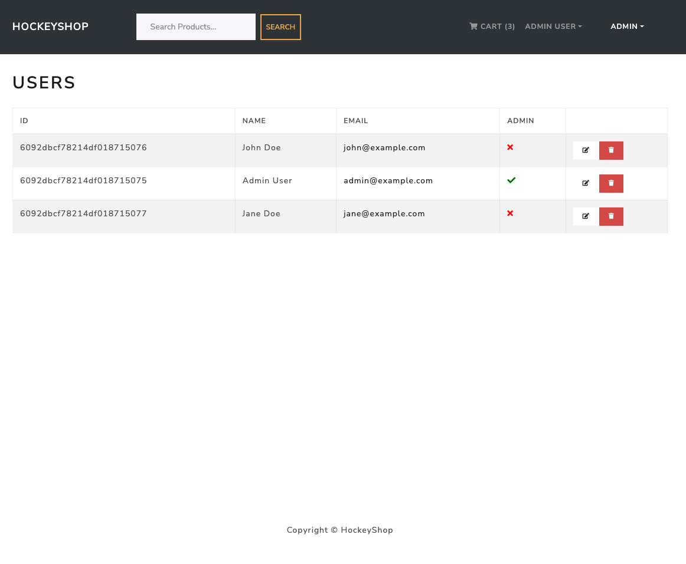

#### Edit User Info

Editing a user's info will let the Admin change the user's name, email address, and Admin status:

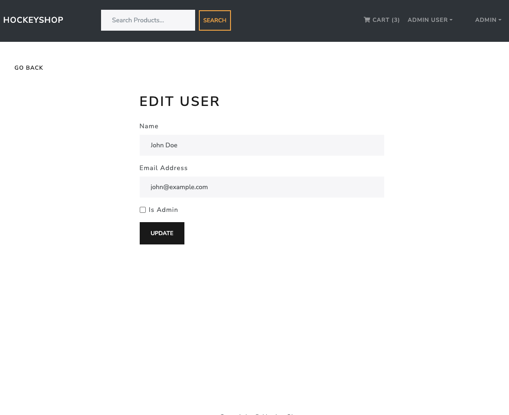

#### Products List

The products list displays all existing products, along with the product ID, name, price, category, and brand. From this dashboard, an Admin has the ability to easily add/edit/delete products:

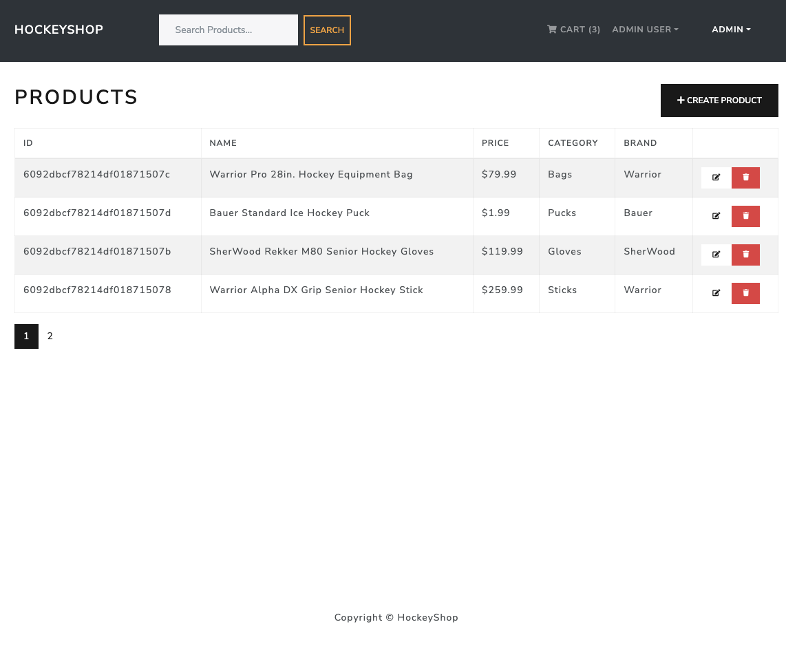

#### Edit Product Info

Editing a product's info allows the Admin to alter a product's name, price, image, brand, count in stock, category, and description:

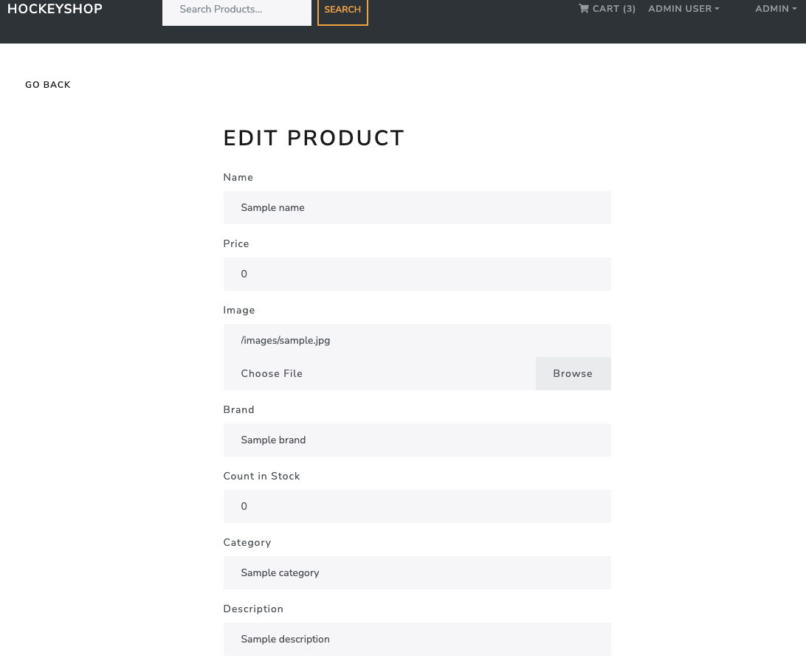

#### Create New Product

Creating a new product is nearly identical to editing an existing product, except an entirely new product will be added to the platform upon creation:

#### Orders List

The orders list is where the Admin may view all orders that have been placed within the platform. The info included here is the order ID, user, date, total, paid status, delivered status, and a direct link to that order's confirmation page:

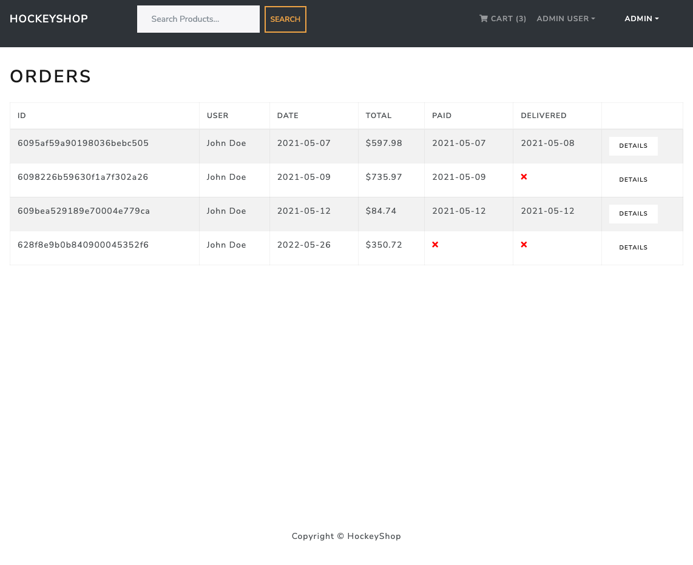

#### Update Order Info

When clicking on the order `Details` within the [Orders List](#orders-list), Admins have the ability to `Mark as Delivered` for any orders that have not been previously marked as delivered:

No other order info is able to be manually updated/edited for record keeping puposes.

It's also important to note that, when a user pays for their order, the order confirmation screen will update to display a green `Paid on` message indicating payment has been received for that particular order (this was previously covered within the [Checkout Process](#checkout-process) section as well):

---

## Licenses

MIT License

Copyright (c) 2022 duncangw1

## Contributing

_Interested in contributing? See the info below._

Contributions are always welcome. If interested, please submit a pull request and they will be reviewed when/if time permits.

## Tests

_No tests are included with this application._

## Questions

_Reach out!_

The best time to reach me is from 8:00am-5:00pm EST, Monday-Friday. All questions will be answered in a timely manner. Emails are preferred.

- Github: [duncangw1](https://github.com/duncangw1)
- Email: duncangw1@gmail.com
